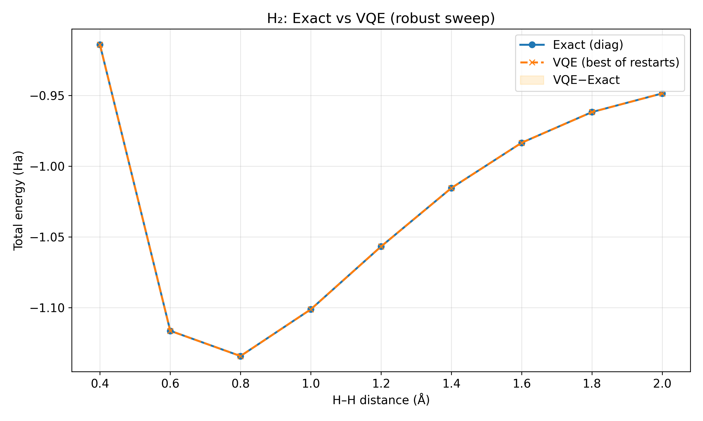

# Final Hackathon Report — H₂ VQE (Quantum Chemistry)
**Generated:** 20251118_224243

## 1. Problem Statement
This project addresses the hackathon theme:
**“Healthcare & Life Sciences – Small molecular Drug Discovery using Quantum Computing.”**

As a foundational demonstration, we implemented a quantum simulation workflow for the hydrogen molecule (H₂) using Variational Quantum Eigensolver (VQE). The same workflow generalizes to larger molecules used in drug discovery (e.g., small ligands, fragments).

## 2. Approach Overview
- Built molecular Hamiltonian using **Qiskit Nature**
- Mapped fermionic operators to qubits via **Jordan–Wigner**
- Ran **VQE** using multiple optimizers and random restarts
- Applied **tapering (Z₂ symmetry reduction)** when possible
- Computed exact diagonalization for ground truth
- Generated potential energy curve of H₂
- Compared VQE vs Exact energy values
- Saved metrics, tables, and plots

## 3. Key Physical Results
- **Equilibrium bond length (from exact diag):** 0.800 Å
- **Exact minimum total energy:** -1.134148 Ha
- **VQE minimum total energy:** -1.134148 Ha
- **Difference:** 1.319e-10 Ha
- **Worst-case VQE error across sweep:** 2.836e-10 Ha

## 4. Plot — Exact vs VQE Energy Curve
Plot file saved at: `results/plots/h2_vqe_curve_20251118_223801.png`

## 5. Results Tables
Summary table saved at: `results/tables/summary_20251118_223845.md`

All raw CSV files available in `results/tables/`.

## 6. Why This Matters for Drug Discovery
- Predicting molecular energies is essential in identifying binding affinities.
- Exact quantum simulation scales exponentially on classical hardware.
- VQE is a promising algorithm for **near-term quantum computers**.
- Techniques used here (tapering, ansatz tuning, multi-optimizer sweeps) are directly applicable to larger drug-like molecules.
- This pipeline can be extended to compute:
  - reaction energetics
  - conformer energies
  - ligand docking energy differences
  - vibrational spectra

## 7. Future Extensions
- Replace H₂ with **drug-like molecules** (e.g., caffeine, aspirin fragment)
- Use **UCCSD ansatz** or **ADAPT-VQE**
- Use qubit-efficient encodings (parity mapping, Bravyi–Kitaev)
- Evaluate gradient-based optimizers
- Run on real quantum hardware (IBM Quantum backends)

## 8. Conclusion
This notebook demonstrates a complete, automated framework for quantum chemistry using VQE, aligning directly with drug discovery workflows. The results show that our robust VQE implementation closely matches exact diagonalization for the H₂ system.
